# C0Farm — Distributed Farm Intelligence Platform

A privacy-preserving, real-time agricultural monitoring system that enables collaborative farm intelligence through sensor networks and cross-cluster alerting.

## 🚀 Quick Start

```bash
npm install
npm run dev
```

Open [http://localhost:3000](http://localhost:3000) in your browser.

### Environment Variables

Create a `.env.local` file:

```env
NEXT_PUBLIC_SUPABASE_URL=your_supabase_url
NEXT_PUBLIC_SUPABASE_ANON_KEY=your_supabase_anon_key
```

## 📁 Project Structure

```
src/
├── app/
│   ├── dashboard/           # Main dashboard with infinite canvas
│   │   ├── page.tsx         # Dashboard orchestration & state
│   │   └── components/
│   │       ├── InfiniteCanvas.tsx  # Node visualization & alert zones
│   │       ├── AlertsPanel.tsx     # Alert list & test triggers
│   │       └── NodeMap.tsx         # Node discovery panel
│   ├── magic-stick/         # 🪄 Sensor stick product visualization
│   ├── settings/            # ⚙️ Alert threshold configuration viewer
│   ├── nodes/new/           # Node registration (manual + CSV upload)
│   └── login/               # Authentication
├── lib/
│   ├── alertConfig.ts       # ⚙️ FINE-TUNE TRIGGERS HERE
│   ├── alertEngine.ts       # Alert evaluation logic
│   ├── simulator.ts         # Synthetic sensor data generator
│   └── supabase.ts          # Supabase client
└── middleware.ts             # Auth middleware
```

## ⚙️ Fine-Tuning Alert Triggers

All alert thresholds are centralized in a single file:

```
src/lib/alertConfig.ts
```

### Current Thresholds

| Alert Type | Conditions | Default Values |
|---|---|---|
| 🐛 Pest Outbreak | Air temp AND humidity | > 40°C AND > 85% |
| 🏜️ Severe Drought | Soil moisture AND water tension | < 0.08 m³/m³ AND > 60 kPa |
| ❄️ Frost Emergency | Air temperature | < 1°C |
| ☣️ Chemical Hazard | TVOC AND soil pH | > 450 µg/m³ AND < 4.8 pH |

### How to Change

1. Open `src/lib/alertConfig.ts`
2. Edit the values in `ALERT_THRESHOLDS`:

```typescript
export const ALERT_THRESHOLDS = {
  pest_outbreak: {
    air_temperature_min: 40,       // Lower this to trigger earlier
    relative_humidity_min: 85,     // Lower this for more sensitivity
  },
  severe_drought: {
    soil_moisture_max: 0.08,       // Raise this for earlier drought alerts
    soil_water_tension_min: 60,    // Lower this for more sensitivity
  },
  frost_emergency: {
    air_temperature_max: 1,        // Raise to 2 or 3 for earlier frost alerts
  },
  chemical_hazard: {
    tvoc_min: 450,                 // Lower for more sensitivity
    soil_ph_max: 4.8,             // Raise for more sensitivity
  },
};
```

3. Save the file and refresh the dashboard.

You can also view current thresholds in the app: **Dashboard → ⚙️ Settings**.

### Alert Radius

```typescript
export const RADIUS_CONFIG = {
  primary_radius_meters: 100,    // Primary alert zone
  fallback_radius_meters: 300,   // Fallback if no nodes in primary zone
};
```

## 🪄 Magic Stick

The **Magic Stick** page (`/magic-stick`) is an interactive product visualization showing the C0Farm sensor node — a solar-powered stick with 16 environmental sensors. Click any sensor to see what it measures and why it matters for farming.

Access: **Dashboard → 🪄 Magic Stick**

## 🧑‍🌾 Farmer View (AI Assistant)

The platform includes a specialized **Farmer View** that translates complex sensor telemetry and alerts into a simple, conversational summary.
It uses Google's **Gemini 2.0 Flash** model to generate non-technical advice directly to the farmer.

- Switch between "Normal" (technical) and "Farmer" (simplified) modes via the dashboard header toggle.
- Assesses current node count, critical alerts, temperature, and moisture to provide instant, contextual advice.

**Prerequisite:** You must have a Gemini API key. Add it to your `.env.local` file:
```env
GEMINI_API_KEY=your_api_key_here
```

## 🔔 Real-Time Alert System

The platform uses **Supabase Realtime** for cross-client alert delivery:

- When a critical condition is detected, the alert is written to the `alerts` table
- All connected clients subscribe to changes via Supabase Realtime
- **Sender** sees a red glowing node + "Your Farm Alert" card
- **Receiver** sees the red radiance zone, glowing connection lines, and "External Cluster Alert" card
- When sender clears the alert, it disappears from all clients in real-time

### Database Setup

Run the migration in your Supabase SQL Editor:

```sql
-- See supabase/migrate_critical_alerts.sql
```

## 📊 System Workflows

### 🌐 Web Application Workflow (Current Implementation)

The current web application uses an event-driven architecture with Supabase Realtime to simulate distributed node intelligence.


### 🌱 Real Concept Workflow (Physical Deployment)

If deployed in the real world, the system would rely on physical IoT networks communicating with a centralized time-series architecture, maintaining the core cross-farm alertness pattern.

```mermaid
flowchart TD
    subgraph The Farm
        Node1[🪄 Magic Stick 1]
        Node2[🪄 Magic Stick 2]
        Node3[🪄 Magic Stick N]
        Earth((Soil & Atmosphere)) --> Node1 & Node2 & Node3
    end

    subgraph Edge Network
        Node1 & Node2 & Node3 -->|LoRaWAN / NB-IoT| Gateway[Solar Edge Gateway]
    end

    subgraph Cloud Infrastructure
        Gateway -->|MQTT / HTTPS| Ingest[Data Ingestion Pipeline]
        Ingest --> DB[(Time-Series DB / Supabase)]
        DB --> AlertEngine[Anomaly Detection Engine]
        AlertEngine -->|Cross-cluster geometric queries| Broadcast[Notification Service]
    end

    subgraph Action Layer
        Broadcast -.->|Real-time Webhooks| WebApp[Next.js Dashboard]
        Broadcast -.->|SMS / Mobile Push| MobileApp[Farmer Mobile Device]
        
        WebApp <-->|Contextualize Data| AI[Gemini 2.0 AI]
        
        WebApp --> |Technical View| Manager((Farm Manager / Agronomist))
        WebApp --> |AI Farmer View| Farmer((Local Farmer))
    end

    classDef hardware fill:#f59e0b,stroke:#d97706,stroke-width:2px,color:black;
    classDef cloud fill:#0ea5e9,stroke:#0369a1,stroke-width:2px,color:black;
    classDef ai fill:#4f46e5,stroke:#3730a3,stroke-width:2px,color:white;
    class Node1,Node2,Node3,Gateway hardware;
    class DB,Ingest,AlertEngine,Broadcast cloud;
    class AI ai;
```



## 🌾 Features

- **Infinite Canvas**: Pan/zoom node visualization with real-time sensor data
- **16 Sensor Types**: Soil, atmospheric, and weather monitoring
- **Farmer View**: AI-powered conversational summaries of farm status using Gemini 2.0 Flash
- **Critical Alerts**: 4 alert types with configurable thresholds
- **Inter-Cluster Alerts**: Cross-farm notifications within 100m (300m fallback)
- **Real-Time Sync**: Supabase Realtime for live multi-client updates
- **Test Triggers**: Simulate any alert type for testing
- **Node Registration**: Manual or CSV batch upload
- **Simulation Playback**: Time-based sensor data with play/pause/speed controls

## 🛠 Tech Stack

- **Framework**: Next.js 14 (App Router)
- **Database**: Supabase (PostgreSQL + Realtime + Auth)
- **AI Integration**: Google Gemini API (latest Flash)
- **Styling**: Vanilla CSS + Tailwind-free utility classes
- **Language**: TypeScript
- **Rendering**: HTML5 Canvas for node visualization
